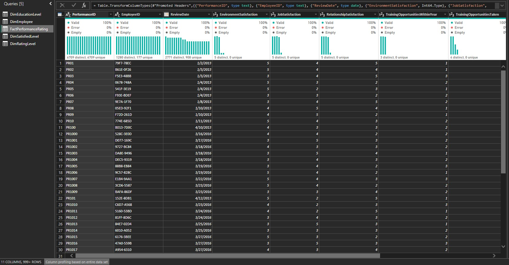
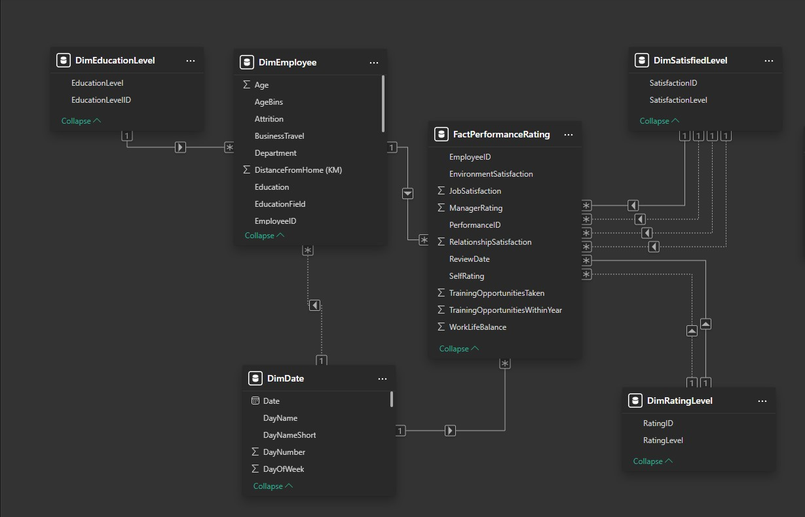
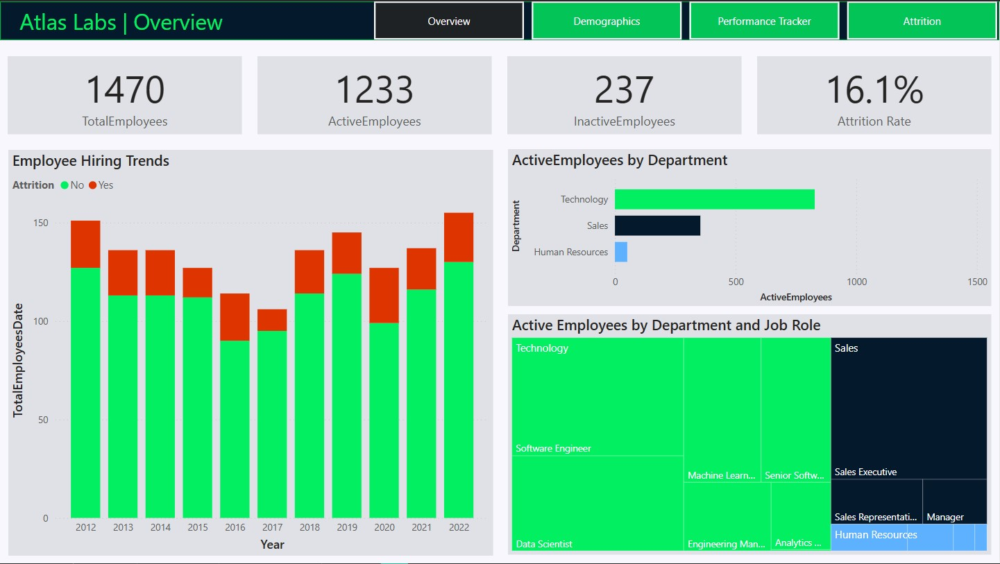
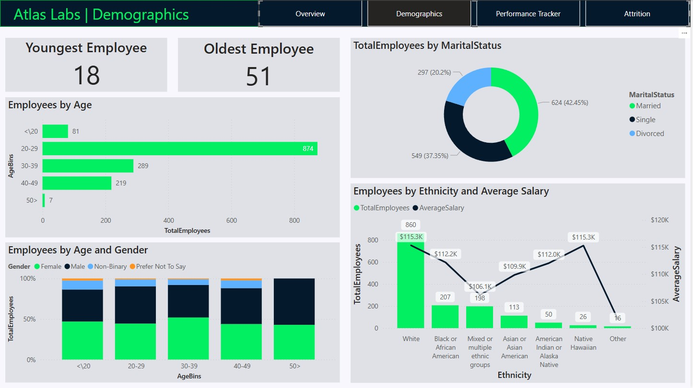
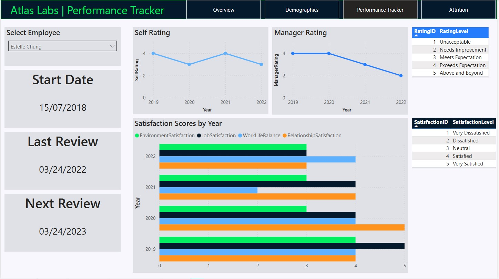
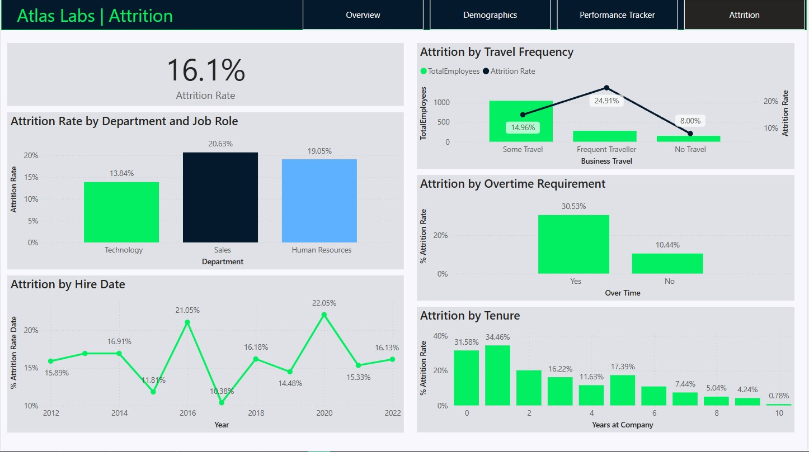

# Atlas-Labs---HR-Analytics-Report

<h3 align="left">The goal is to build a report using fictitious datasets from a Tech company called Atlas Labs. Atlas Labs HR team want to be able to monitor key metrics on employees. Their secondary goal is to understand what factors impact employee attrition.</h3>
<h3 align="left">I downloaded this dataset from DataCamp and this is a data description:</h3>

<h3 align="left">Fact Table:</h3>

- PerformanceRatings - Collects information about the results of the annual employee evaluation
<h3 align="left">Dimension Tables:</h3>

- Employee - Employee information
- EducationLevel - Education level
- RatingLevel - Rating level
- SatisfiedLevel - Employee satisfaction level

<h3 align="left">1. I open Power BI Desktop and load the dataset to inspect and clean the data for making the report.</h3>

<h5 align="left">I started to clean data in every table. to make sure every table didn't have any duplicates, outliers, and errors. Change the data type to the proper data type and change the table name.</h5>
<h5 align="left">Now the data set is clean and ready for analysis and visualization. I closed the power query to go to the next step.</h5>
<h5 align="left">In to next step, I created a dimension date table to use the time intelligence function in DAX, display data continuously even if the fact table does not contain data for every day, and easier to set the format of day, month, quarter, year</h5>
<h5 align="left">And created the relationship between the table and the data model.</h5>

<h5 align="left">The Relationship between the FactPerformanceRating table the DimSatisfiedLevel table and the DimRatingLevel are made multiple times.</h5>
<h5 align="left">Because the FactPerformanceRating table has columns that can be linked to the DimSatisfiedLevel table by column EnvironmentSatisfaction, JobSatisfaction, RelationshipSatisfaction, and WorkLifeBalance columns, each of which is an ID that refers back to the DimSatisfactionLevel table.</h5>
<h5 align="left">And the DimRatingLevel table is linked to the SelfRating, and ManagerRating columns in the fact table, each of which is an ID that refers back to the DimSatisfactionLevel table as well.</h5>

<h3 align="left">2. Time to create the report and visualization.</h3>
<h3 align="left">Here this is my result</h3>
<h3 align="left">This is the first page "Overview"</h3>

<h5 align="left">On this page, you can see the total employees, the total number of employees who are still active in the company, the total number of employees who are already in attrition, and the attrition rate on the top.</h5>
<h5 align="left">On the left bottom chart, you will see trends in employee hire and employee attrition by each year.</h5>
<h5 align="left">On the right middle bar chart, you will see the total employees who are still active in the company. And right bottom tree chart more division from department to job role.</h5>

<h3 align="left">Next is the second page "Demographics"</h3>

<h5 align="left">On this page, you can see the details of demographics by employees. You can see the youngest employee and oldest employee in the company at the top, the distribution of age on the left middle bar chart, and the distribution by age and gender at the left bottom stack column chart.</h5>
<h5 align="left">At the right donut chart, you will see total employees by marital status, and at the right bottom column and line chart, you will see total employees by ethnicity and average salary.</h5>

<h3 align="left">Next is the third page "Performance Tracker"</h3>

<h5 align="left">On this page, you can track about performance of each employee. You can see the start date(the date since the employee is active), the last review date, and the next review date for the employee.</h5>
<h5 align="left">On the right, you will see trends of performance rating by self-rating and manager rating. For the Clustered bar chart at the bottom, you will see trends of satisfaction score legend by work factor.</h5>
<h5 align="left">You can filter for interested employees by clicking on the select employee at the top left corner as shown in the image.</h5>

<h3 align="left">And this is the final page "Attrition"</h3>

<h5 align="left">On this page, you will see factors that impact employee attrition.</h5>
<h5 align="left">On the left middle chart, you will see the attrition rate by employee department. The sales department has the highest attrition rate. On the left bottom line chart, you will see the attrition rate by year.</h5>
<h5 align="left">On the right top chart, you will see the total employees and attrition rate by frequency of travel. You will see that employees who frequently travel have the highest attrition rate.</h5>
<h5 align="left">On the right middle chart, you will see the attrition rate by overtime requirement. So the employee who works overtime has more higher attrition rate than the employee who doesn't work overtime.</h5>
<h5 align="left">And the last one, at the right bottom chart, you will see the attrition rate by tenure. You will see that employee who work for fewer years has more higher attrition rate than employees who work for more years at the company.</h5>

<h3 align="left">Finally, you can download my pbix file to see more details. Thank you for watching.</h3>
