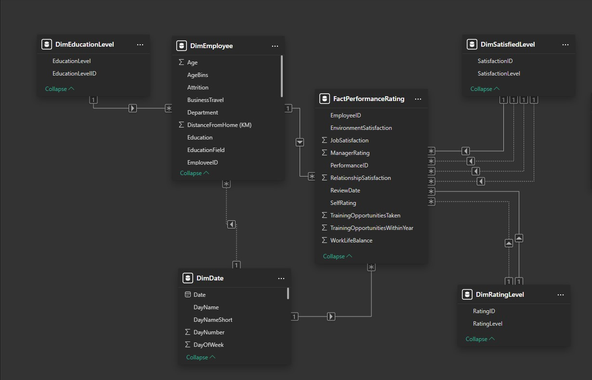
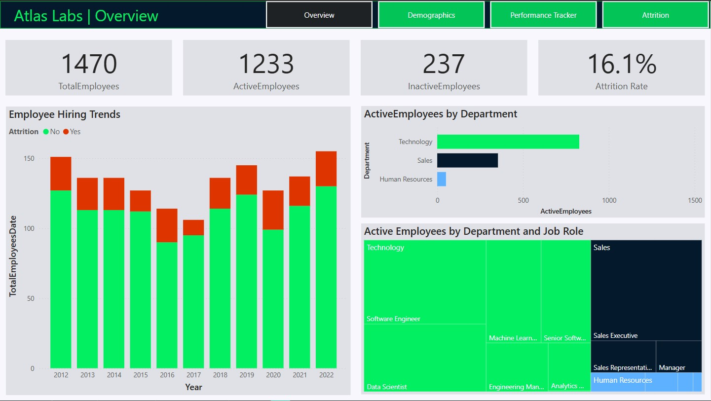
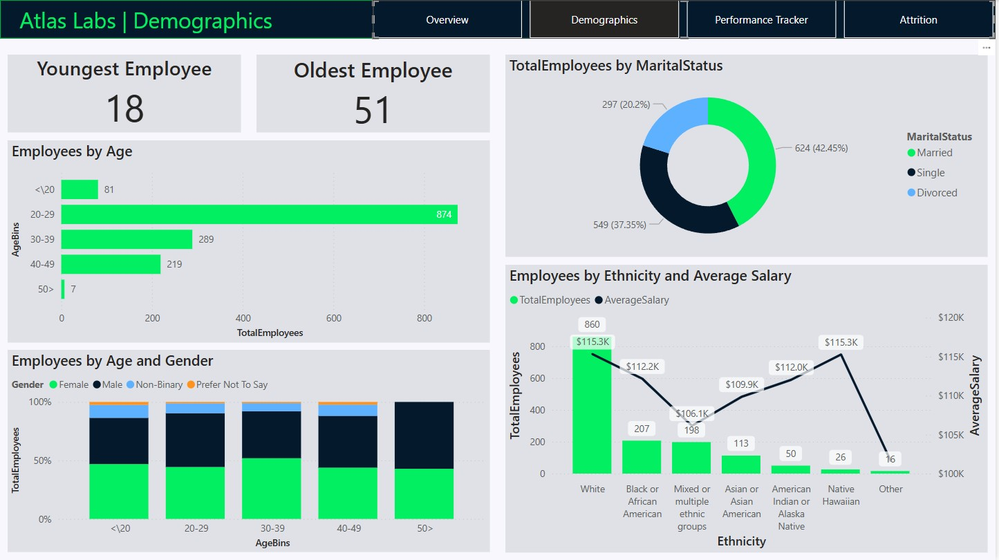
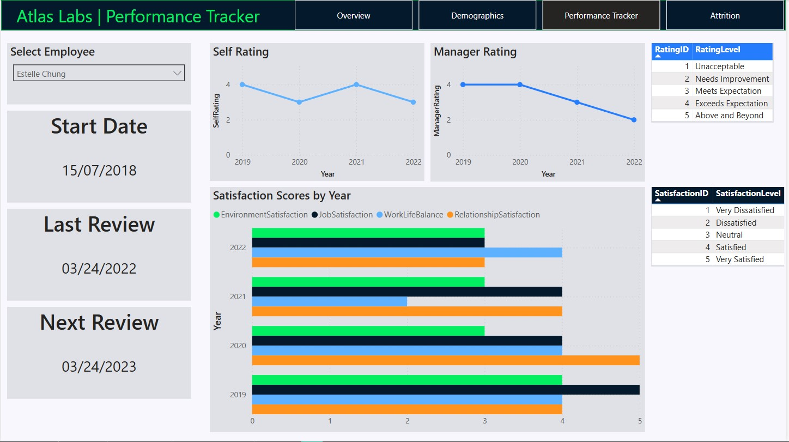
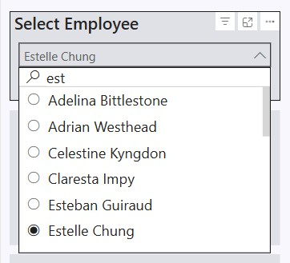
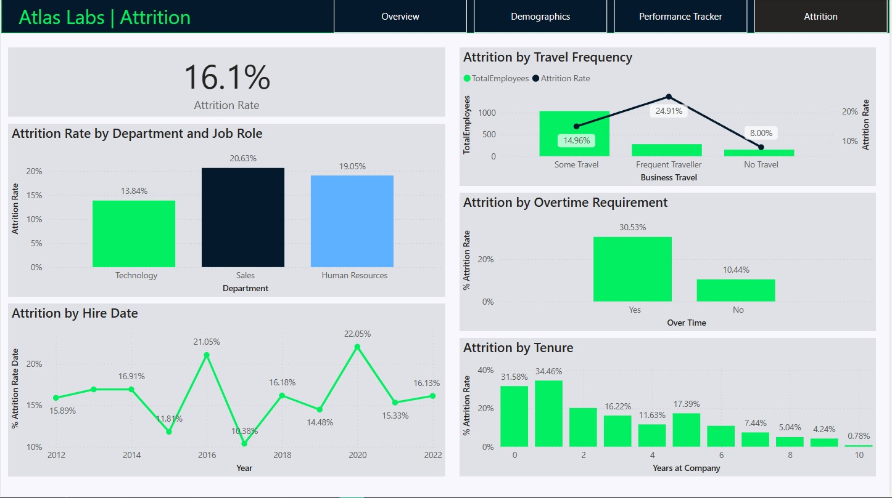

# Atlas Labs HR Analytics Report

This report provides an in-depth analysis of employee performance, demographics, and attrition within **Atlas Labs** using **Power BI**. By exploring key HR metrics, the report identifies trends and factors driving employee turnover, offering actionable insights for HR decision-makers.

---

## Table of Contents
1. [Introduction](#introduction)  
2. [Dataset Overview](#dataset-overview)  
3. [Data Preparation](#data-preparation)  
   - [Data Inspection and Cleaning](#data-inspection-and-cleaning)  
   - [Exploratory Data Analysis (EDA)](#exploratory-data-analysis-eda)  
   - [Data Modeling](#data-modeling)  
4. [Report and Visualization](#report-and-visualization)  
   - [Overview Page](#overview-page)  
   - [Demographics Page](#demographics-page)  
   - [Performance Tracker Page](#performance-tracker-page)  
   - [Attrition Page](#attrition-page)  
5. [Key Findings & Insights](#key-findings--insights)  
6. [How to Use This Project](#how-to-use-this-project)  
7. [Future Work & Improvements](#future-work--improvements)  
8. [References](#references)  

---

## Introduction
This report analyzes employee performance, demographics, and attrition within **Atlas Labs** using Power BI. It leverages comprehensive datasets to explore employee retention, satisfaction levels, and the factors that contribute to employee turnover. The primary objective is to provide HR leaders with actionable insights that inform strategies to reduce attrition and enhance workforce stability.

---

## Dataset Overview
The dataset comprises several key tables:

- **Fact Table:**
  - **PerformanceRatings**: Contains annual performance evaluation results.
- **Dimension Tables:**
  - **Employee**: Personal information of employees.
  - **EducationLevel**: Details on employee education backgrounds.
  - **RatingLevel**: Performance rating scales.
  - **SatisfiedLevel**: Employee satisfaction ratings.

---

## Data Preparation

### Data Inspection and Cleaning
- Loaded the dataset into **Power BI Desktop**.
- Conducted thorough data inspection to remove duplicates, outliers, and errors.
- Standardized data types and renamed tables for clarity.
- Designated the **PerformanceRatings** table as the primary fact table.

### Exploratory Data Analysis (EDA)
- Performed an initial exploration to understand data distributions and trends.
- Identified key patterns in employee performance, satisfaction, and attrition.
- Detected and visualized outliers that could impact HR decision-making.

### Data Modeling
- Developed a **Dimension Date Table** to leverage time intelligence functions in DAX.
- Established robust relationships between **PerformanceRatings** and both **DimSatisfiedLevel** and **DimRatingLevel**.

> 

---

## Report and Visualization

### Overview Page
- **Key Metrics**: Displays total employee counts (active vs. attrited), employee trends over time, and departmental breakdowns.
- **Visualizations**: Features charts depicting overall HR metrics to provide a snapshot of workforce dynamics.

**Explanation**:  
This page offers a high-level overview of HR metrics, enabling quick assessments of the company’s employee base and overall performance trends.

> 

### Demographics Page
- **Age Distribution**: Visualizes the distribution of employee ages.
- **Marital Status & Ethnicity**: Presents the count of employees by marital status and shows average salary by ethnicity.

**Explanation**:  
This page provides insights into the demographic composition of the workforce, revealing key patterns such as the predominance of younger employees (e.g., 20-29 years old) and diversity metrics within the organization.

> 

### Performance Tracker Page
- **Employee Performance Details**: Displays individual employee performance data including start date, last review date, and next review date.
- **Performance Trends**: Visualizes trends in self-ratings, manager ratings, and satisfaction scores.
- **Interactive Filtering**: Enables filtering of employee data for deeper performance analysis.

**Explanation**:  
This page allows HR teams to track performance metrics over time, facilitating targeted interventions and performance improvement strategies.

>   
> 

### Attrition Page
- **Attrition Analysis**: Examines factors influencing employee turnover, including department, overtime, travel frequency, and tenure.
- **Key Insights**: Highlights that the Sales department experiences higher attrition, particularly among employees with frequent travel, overtime work, and shorter tenure.

**Explanation**:  
This page is crucial for understanding why employees leave the organization. It identifies risk factors associated with attrition, thereby informing strategies to improve retention.

> 

---

## Key Findings & Insights
- **Employee Performance Trends**: Clear patterns indicate areas of strength and opportunities for improvement in employee performance.
- **Demographic Patterns**: The majority of the workforce falls within the 20-29 age range, which has implications for talent development.
- **Attrition Drivers**: High turnover rates in specific departments, particularly Sales, are linked to factors such as overtime, frequent travel, and short tenure.
- **Actionable Insights**: These insights provide a foundation for developing strategies to enhance employee satisfaction and reduce turnover.

---

## How to Use This Project

### Power BI Report
1. Download the `hr_analytics_report_atlaslabs.pbix` file.
2. Open it using **Power BI Desktop**.
3. Interact with the dashboards to explore detailed HR insights and trends.

### Using Cleaned Data
- The cleaned data file (`cleaned_data.csv`) is available for further analysis using **Python**, **R**, or **SQL**.

---

## Future Work & Improvements
- **Expand the Dataset**: Incorporate additional data sources such as employee feedback and exit interviews.
- **Predictive Analytics**: Develop machine learning models to forecast attrition trends and proactively address retention issues.
- **Employee Sentiment Analysis**: Utilize sentiment analysis to assess workplace satisfaction and identify areas for HR intervention.

---

## References
- [DataCamp Dataset](https://www.datacamp.com)  
- Research papers on HR analytics, employee retention strategies, and workforce management.
